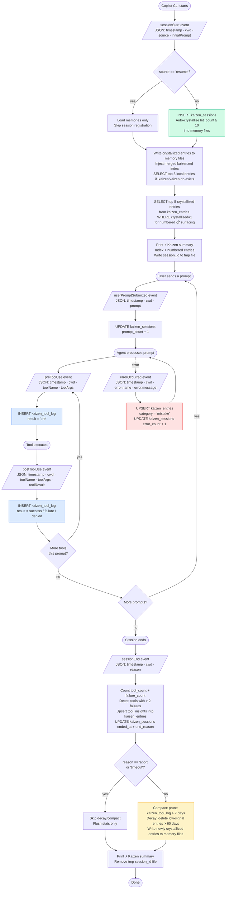

# Kaizen — Copilot CLI Plugin

> *改善* — continuous improvement

AI coding sessions are amnesiac by default. Each session starts fresh — no memory of what worked, what broke, which tools you reach for most, or what patterns your team has settled on. **Kaizen** fixes that.

Kaizen hooks into the Copilot CLI event system and builds a persistent, compounding memory across every session. Errors accumulate into patterns. Patterns crystallize into procedures. Procedures feed back into the next session — tightening the loop over time.

```
Observe → Reflect → Improve → Observe better
   ↑                                   │
   └───────────────────────────────────┘
```

---

## Install

### As a Copilot CLI Plugin (recommended)

```bash
copilot plugin install yldgio/copilot-kaizen
```

Or from a local clone:

```bash
copilot plugin install /path/to/copilot-hooks
```

Verify it loaded:

```bash
copilot plugin list
# → kaizen (v1.0.0)
```

The hooks are active immediately in your next session. No configuration needed.

### Update

```bash
copilot plugin update kaizen
```

### Uninstall

```bash
copilot plugin uninstall kaizen
```

---

## Manual Install (copy files into a repo)

If you prefer to commit the hook scripts directly into a target repository:

**Bash (Linux / macOS / Windows+GitBash)**

```bash
mkdir -p .github/hooks/kaizen
cp hooks/kaizen/kaizen.sh  .github/hooks/kaizen/
cp hooks/kaizen/kaizen.ps1 .github/hooks/kaizen/
cp hooks/kaizen/hooks.json .github/hooks/kaizen.json
chmod +x .github/hooks/kaizen/kaizen.sh
```

**PowerShell (Windows / pwsh)**

```powershell
New-Item -ItemType Directory -Force -Path .github/hooks/kaizen
Copy-Item hooks\kaizen\kaizen.sh, hooks\kaizen\kaizen.ps1 -Destination .github\hooks\kaizen\
Copy-Item hooks\kaizen\hooks.json -Destination .github\hooks\kaizen.json
```

The CLI loads any `*.json` file under `.github/hooks/` — the filename `kaizen.json` is just a convention.

---

## How It Works — The Six-Event Loop

Kaizen registers six lifecycle events. Each handler is designed to exit in **milliseconds** — all SQLite writes happen in a background process so the agent is never blocked.

| Event | What Kaizen does |
|-------|-----------------|
| `sessionStart` | Loads top observations into agent context; registers the session; auto-crystallizes high-signal entries |
| `userPromptSubmitted` | Increments `prompt_count` on the session row |
| `preToolUse` | Logs tool intent (`result = 'pre'`) — evidence of attempted calls even if the tool crashes |
| `postToolUse` | Logs tool result (`success` / `failure` / `denied`) |
| `errorOccurred` | Upserts the error as a `mistake` observation; increments session `error_count` |
| `sessionEnd` | Finalises session stats; promotes repeated tool failures to observations; runs decay/compact cleanup |

> **Why log `'pre'`?** If a tool crashes before `postToolUse` fires, the `'pre'` row is the only evidence it was attempted. At session end: `abandoned = pre_rows − (success + failure + denied)`.

---

## Two-Tier Memory

Kaizen maintains two storage layers: **SQLite** for accumulation and counting, and **Markdown files** for crystallized knowledge.

### SQLite databases

| | Global `~/.copilot/kaizen.db` | Local `.kaizen/kaizen.db` |
|--|-------------------------------|---------------------------|
| **Scope** | All repos on this machine | This repo only |
| **What lives here** | Raw observations, tool logs, session metadata | Repo-specific raw observations |
| **Read by** | All session starts | Session starts (when file exists) |
| **Written by** | All events | Your team, manually |
| **Team sharing** | Not shared | Commit `.kaizen/*.md` to share with your team |

### DB writes by event

| Event | Global DB | Local DB |
|-------|-----------|----------|
| `sessionStart` | READ entries; INSERT session; WRITE crystallized entries to memory files | READ entries |
| `userPromptSubmitted` | UPDATE session `prompt_count` | — |
| `preToolUse` | INSERT tool log (`result='pre'`); INJECT tool memory file if first use | — |
| `postToolUse` | INSERT tool log (actual result) | — |
| `errorOccurred` | UPSERT mistake entry; UPDATE session `error_count` | — |
| `sessionEnd` | UPDATE session; INSERT tool insights; WRITE new crystallized entries to files; DELETE old rows | — |

### Memory files

When an observation reaches `hit_count ≥ 10` it is **crystallized**— written to a Markdown file and injected into future sessions on demand:

```
~/.copilot/kaizen/        ← global memory (all repos)
  kaizen.md               ← index: one line per topic file
  general.md              ← cross-project conventions and mistakes
  tools/
    bash.md               ← insights for the bash tool
    {tool_name}.md        ← one file per tool that has crystallized observations
  domain/
    {topic}.md            ← project or domain-specific knowledge

.kaizen/                  ← project-local memory (this repo, committed)
  kaizen.md               ← local index (same format, scoped to this project)
  general.md
  tools/
  domain/
  kaizen.db               ← raw observations DB (gitignored)
```

At `sessionStart`, the merged global + local `kaizen.md` index is injected into the agent context. At `preToolUse`, the relevant `tools/{tool}.md` file is injected the first time each tool is called.

---

## How Observations Compound

The `hit_count` field is the core signal. Every time the same error is seen again, `hit_count` increments. When it reaches **10**, the entry is auto-crystallized into the appropriate memory file (`general.md`, `tools/{name}.md`, or `domain/{topic}.md`) at the next `sessionStart` or `sessionEnd`.

| When | What happens |
|------|-------------|
| **Day 1** | A `NetworkTimeoutError` appears once. `hit_count = 1`. |
| **Week 2** | Same error seen 7 more times. `hit_count = 8`. Starts surfacing in top-5. |
| **Month 2** | `hit_count` hits 10. Auto-crystallized: written to `general.md` (or `tools/{name}.md`) at next `sessionStart` or `sessionEnd`. |
| **Month 3** | The entry has `applied_count = 12`. Agent has been acting on it every session. |

Low-signal entries (`hit_count < 3`) older than 60 days are pruned automatically. Only signal survives.

---

## Adding Observations Manually

Insert directly into the global or local database:

```bash
# Record a codebase-specific convention
sqlite3 ~/.copilot/kaizen.db "
INSERT INTO kaizen_entries (scope, category, content, source)
VALUES ('global', 'preference', 'Always run npm run lint before committing', 'manual');
"

# Record a team convention in the local (repo-shared) DB
sqlite3 .kaizen/kaizen.db "
INSERT INTO kaizen_entries (scope, category, content, source)
VALUES ('local', 'pattern', 'Use Result<T> not exceptions for expected failures', 'team');
"
```

### Categories

| Category | Use for |
|----------|---------|
| `pattern` | Code patterns, architectural conventions, naming rules |
| `mistake` | Errors, bugs, anti-patterns to avoid |
| `preference` | Tooling preferences, workflow shortcuts |
| `tool_insight` | Observations about tool usage (auto-populated by hooks) |

---

## Phase 2 — The Self-Improving Loop

Phase 1 observes and remembers. Phase 2 closes the feedback loop.

### Crystallized Memory Files

When an observation hits `hit_count ≥ 10`, it is auto-promoted at the next `sessionStart` or `sessionEnd` — written to the appropriate memory file and injected into future sessions on demand. The memory is routed by category:

| Category | Memory file |
|----------|-------------|
| `tool_insight` | `tools/{tool_name}.md` |
| `mistake` | `general.md` |
| other | `domain/{category}.md` |

### Skills

| Skill | What it does |
|-------|-------------|
| `crystallize` | Runs `reorganize` on the memory hierarchy (dedup, merge, sort), then prints the merged `kaizen.md` index — human-readable, committable, shareable with your team |
| `kaizen-mark --applied <id>` | Marks a crystallized entry as applied after the agent acts on it. Increments `applied_count` on `kaizen_entries` and records `last_applied_at` |

### Observation Lifecycle

1. **Observation** — errors, patterns, tool insights accumulate with `hit_count` in `kaizen_entries`
2. **Crystallization** — at `hit_count ≥ 10`, written to a memory `.md` file; `kaizen_entries.crystallized = 1`
3. **Surfacing** — at `sessionStart`: merged `kaizen.md` index injected; at `preToolUse`: relevant `tools/{name}.md` injected on first use of each tool
4. **Application** — agent marks entries as applied via `kaizen-mark --applied <id>`
5. **Team sharing** — `crystallize` reorganizes files; `git add .kaizen/*.md` shares with the team
6. **Decay** — low-signal observations pruned (60 days, `hit_count < 3`, never applied)

The loop: better observations → better memory files → better sessions → better observations.

---

## Memory Files

Kaizen stores crystallized knowledge as human-readable markdown files that can be committed to git.

### File hierarchy

```
~/.copilot/kaizen/              ← global (cross-project)
  kaizen.md                     ← index: one line per topic file
  general.md                    ← cross-project conventions, mistakes
  tools/{tool_name}.md          ← per-tool observations
  domain/{topic}.md             ← domain-specific knowledge

.kaizen/                        ← project-local (committable)
  kaizen.md                     ← local index
  general.md                    ← project-level conventions
  tools/{tool_name}.md          ← project-scoped tool observations
  domain/{topic}.md             ← project knowledge
```

### How entries are routed

| Category | Target file | Notes |
|----------|-------------|-------|
| `tool_insight` | `tools/{tool_name}.md` | Tool name extracted from content |
| `mistake` | `general.md` | Mistakes are cross-cutting |
| Other | `domain/{category}.md` | Category becomes topic name |

### Sharing with the team

```bash
# Reorganize and review
bash skills/crystallize/crystallize.sh

# Commit project memory
git add .kaizen/*.md .kaizen/**/*.md
git commit -m "chore: update kaizen memory files"
```

### .gitignore

Add these lines to your project's `.gitignore`:

```
.kaizen/*.db
.kaizen/**/*.db
```

This keeps SQLite databases out of git while allowing the markdown memory files to be committed and shared.

---

## Disable

Set `SKIP_KAIZEN=1` to disable all hooks for a session:

```bash
SKIP_KAIZEN=1 gh copilot suggest "..."
```

Or permanently for a shell:

```bash
export SKIP_KAIZEN=1
```

---

## Requirements

| Dependency | Bash | PowerShell | Notes |
|-----------|------|-----------|-------|
| `sqlite3` | Required | Required | macOS: pre-installed. Linux: `apt install sqlite3` / `dnf install sqlite`. Windows: `winget install SQLite.SQLite` |
| `jq` | Optional | Not used | Falls back to `python3`/`python`, then `sed` |
| `python3`/`python` | Optional fallback | Not used | Used when `jq` is absent |
| `git` | Optional | Optional | Used only to resolve repo name from remote |

PowerShell uses `ConvertFrom-Json` natively — no external JSON tools needed.

---

## Flow Diagram



---

## File Reference

```
copilot-hooks/
├── .github/plugin/plugin.json   ← plugin manifest
├── hooks.json                   ← hook config (auto-discovered by the CLI)
├── hooks/kaizen/
│   ├── kaizen.sh                ← bash implementation (Linux / macOS / Windows+GitBash)
│   ├── kaizen.ps1               ← PowerShell implementation (Windows native / pwsh everywhere)
│   └── hooks.json               ← hook config for manual install into a target repo
└── skills/
    ├── crystallize/
    │   ├── SKILL.md             ← skill definition (official format)
    │   ├── crystallize.sh       ← runs reorganize + prints merged kaizen.md index
    │   └── crystallize.ps1      ← PowerShell equivalent
    └── kaizen-mark/
        ├── SKILL.md             ← skill definition (official format)
        ├── kaizen-mark.sh       ← marks kaizen_entries.applied_count + 1
        └── kaizen-mark.ps1      ← PowerShell equivalent

# Memory files written by the hooks (not part of this repo):
~/.copilot/kaizen/               ← global memory (per machine)
  kaizen.md                      ← index injected at every sessionStart
  general.md                     ← cross-project mistakes + conventions
  tools/{tool_name}.md           ← per-tool insights (injected at first preToolUse)
  domain/{topic}.md              ← project/domain knowledge

.kaizen/                         ← project-local memory (per repo)
  kaizen.md                      ← local index (committed)
  general.md                     ← project conventions (committed)
  tools/{tool_name}.md           ← project-scoped tool insights (committed)
  domain/{topic}.md              ← project/domain knowledge (committed)
  kaizen.db                      ← raw observations SQLite DB (gitignored)
```
