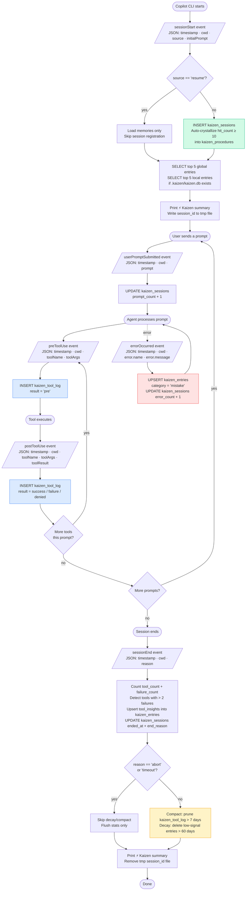

# Kaizen Hook — Implementation Plan

## Vision

**Kaizen** (改善) means "continuous improvement". This hook system embeds that philosophy into every AI coding session: the agent observes its own behaviour, reflects on patterns, and persists structured improvement cycles across sessions.

The self-referential principle: **the improvement process itself is subject to improvement**. Raw observations compound into structured procedures. Those procedures, applied consistently, generate better observations. The loop tightens over time.

```
Observe → Reflect → Improve → Observe better
   ↑                                   │
   └───────────────────────────────────┘
```

### Two horizons

1. **(Phase 1 — now)** Capture tool patterns and kaizen observations across sessions, persist them in SQLite, surface them at session start — with a schema designed to fuel Phase 2 without migrations.
2. **(Phase 2 — future)** Analyze accumulated observations, detect high-signal patterns, and **crystallize them into structured improvement procedures** — making the improvement process itself better over time.

---

## Approach

- **Dual-script**: `kaizen.sh` (bash) for Linux / macOS / Windows+GitBash, and `kaizen.ps1` (PowerShell) for Windows native and PowerShell Core on any platform. Both implement identical logic and share the same DB schema and file paths.
- **Single `hooks.json`** — a single manifest file with both `"bash"` and `"powershell"` fields per event entry. The runtime picks the correct one based on OS. No separate PowerShell hooks file is needed or supported.
- Two-tier SQLite memory: global (`$HOME/.copilot/kaizen.db`) + local (`.kaizen/kaizen.db`). `$HOME` resolves correctly in both bash and PowerShell.
- **No "skill" terminology in the database** — everything is a kaizen observation or a kaizen procedure. The DB tables are named accordingly.
- Schema is richer than a naive implementation to be Phase 2-ready: adds `session_id` tracking, a `kaizen_sessions` table, and a `kaizen_procedures` table (crystallized patterns — not yet populated in Phase 1, but schema is in place to avoid future migrations).
- **Non-blocking by design** — the runtime executes hooks synchronously (blocks the agent until the script exits). Every handler must exit immediately. DB writes are dispatched to a background process (`&` in bash, `Start-Job` in PowerShell) so the script exits in milliseconds. If sqlite3 is unavailable or a write fails, the script exits 0 silently.

---

## Cross-Platform Design

| Concern | Bash (`kaizen.sh`) | PowerShell (`kaizen.ps1`) |
|---------|-------------------|--------------------------|
| Platform | Linux, macOS, Windows+GitBash | Windows (pwsh/powershell), pwsh on Linux/Mac |
| Home path | `$HOME` | `$HOME` (works in both) |
| sqlite3 | Pre-installed on macOS/Linux | Must be installed (winget/choco/scoop); script warns if missing |
| JSON parsing | `jq` (optional, graceful degradation) | `ConvertFrom-Json` natively — **no jq needed** |
| Session ID | `$(date +%Y%m%dT%H%M%S)_$$` | `[datetime]::UtcNow.ToString('yyyyMMddTHHmmss')_$PID` |
| Disable env var | `SKIP_KAIZEN` | `$env:SKIP_KAIZEN` |
| **DB writes** | Background subshell (exit immediately): `( sqlite3 ... ) &` | Background job (exit immediately): `Start-Job { ... } \| Out-Null` |
| **Failure mode** | Any error → `exit 0` silently | Any error → `exit 0` silently |
| **Why** | Runtime blocks agent until script exits; script must return in ms | Same — hooks are synchronous from the runtime's perspective |

---

## File Structure (to create)

```
hooks/kaizen/
├── README.md           ← full user-facing docs (philosophy + both platforms)
├── hooks.json          ← install at .github/hooks/hooks.json in target repo
├── kaizen.sh           ← bash implementation (Linux / macOS / Windows+GitBash)
└── kaizen.ps1          ← PowerShell implementation (Windows native / pwsh everywhere)
```

> 📁 **Install location**: Hooks files are loaded from `.github/hooks/*.json` in the repository root. Copy or symlink `hooks.json` to `.github/hooks/kaizen.json` (any filename works). Copy `kaizen.sh` and `kaizen.ps1` to `.github/hooks/kaizen/`.

```json
{
  "version": 1,
  "hooks": {
    "sessionStart": [{
      "type": "command",
      "bash":        ".github/hooks/kaizen/kaizen.sh sessionStart",
      "powershell":  ".github/hooks/kaizen/kaizen.ps1 sessionStart",
      "cwd": ".", "timeoutSec": 5
    }],
    "userPromptSubmitted": [{
      "type": "command",
      "bash":        ".github/hooks/kaizen/kaizen.sh userPromptSubmitted",
      "powershell":  ".github/hooks/kaizen/kaizen.ps1 userPromptSubmitted",
      "cwd": ".", "timeoutSec": 2
    }],
    "preToolUse": [{
      "type": "command",
      "bash":        ".github/hooks/kaizen/kaizen.sh preToolUse",
      "powershell":  ".github/hooks/kaizen/kaizen.ps1 preToolUse",
      "cwd": ".", "timeoutSec": 2
    }],
    "postToolUse": [{
      "type": "command",
      "bash":        ".github/hooks/kaizen/kaizen.sh postToolUse",
      "powershell":  ".github/hooks/kaizen/kaizen.ps1 postToolUse",
      "cwd": ".", "timeoutSec": 3
    }],
    "errorOccurred": [{
      "type": "command",
      "bash":        ".github/hooks/kaizen/kaizen.sh errorOccurred",
      "powershell":  ".github/hooks/kaizen/kaizen.ps1 errorOccurred",
      "cwd": ".", "timeoutSec": 3
    }],
    "sessionEnd": [{
      "type": "command",
      "bash":        ".github/hooks/kaizen/kaizen.sh sessionEnd",
      "powershell":  ".github/hooks/kaizen/kaizen.ps1 sessionEnd",
      "cwd": ".", "timeoutSec": 10
    }]
  }
}
```

> **Not hooked — `agentStop` and `subagentStop`**: The docs list two additional hook types (`agentStop` fires when the main agent finishes responding to a prompt; `subagentStop` fires when a subagent completes). Kaizen does not hook these in Phase 1 — `sessionEnd` is sufficient for end-of-session accounting. This is a conscious exclusion, not an omission.

---

## Naming Map

| Concept | Name used |
|---------|-----------|
| Hook folder | `kaizen` |
| Bash script | `kaizen.sh` |
| PowerShell script | `kaizen.ps1` |
| Disable env var | `SKIP_KAIZEN` |
| Global DB | `~/.copilot/kaizen.db` |
| Local DB | `.kaizen/kaizen.db` |
| Local dir | `.kaizen/` |
| Raw observations table | `kaizen_entries` |
| Tool telemetry table | `kaizen_tool_log` |
| Session metadata table | `kaizen_sessions` |
| Crystallized patterns table | `kaizen_procedures` *(schema only in Phase 1)* |
| Emoji | `⚡ Kaizen` |
| Bash hook path | `.github/hooks/kaizen/kaizen.sh` |
| Pwsh hook path | `.github/hooks/kaizen/kaizen.ps1` |
| Hook events used | `sessionStart`, `userPromptSubmitted`, `preToolUse`, `postToolUse`, `errorOccurred`, `sessionEnd` — all confirmed in official docs |
| Hook events excluded | `agentStop`, `subagentStop` — exist in docs, not used in Phase 1 (conscious exclusion) |
| Hook file install path | `.github/hooks/kaizen.json` (any filename under `.github/hooks/` is loaded) |
| preToolUse result marker | `'pre'` (in `kaizen_tool_log.result`) |

---

## Phase 1 Schema

```sql
-- Raw kaizen observations (one per insight)
CREATE TABLE IF NOT EXISTS kaizen_entries (
    id            INTEGER PRIMARY KEY AUTOINCREMENT,
    scope         TEXT NOT NULL,    -- 'global' or 'local'
    category      TEXT NOT NULL,    -- 'pattern', 'mistake', 'preference', 'tool_insight'
    content       TEXT NOT NULL,
    source        TEXT,             -- repo name, session_id, 'user_correction', etc.
    created_at    TEXT DEFAULT (datetime('now')),
    last_seen     TEXT DEFAULT (datetime('now')),
    hit_count     INTEGER DEFAULT 1,
    crystallized  INTEGER DEFAULT 0  -- 1 = promoted to kaizen_procedures (Phase 2 flag)
);

-- Tool call telemetry (session-aware for Phase 2 aggregation)
CREATE TABLE IF NOT EXISTS kaizen_tool_log (
    id          INTEGER PRIMARY KEY AUTOINCREMENT,
    session_id  TEXT,
    tool_name   TEXT,
    result      TEXT,
    ts          TEXT DEFAULT (datetime('now'))
);

-- Session metadata (Phase 2 foundation — written at sessionEnd)
CREATE TABLE IF NOT EXISTS kaizen_sessions (
    session_id    TEXT PRIMARY KEY,
    repo          TEXT,
    started_at    TEXT DEFAULT (datetime('now')),
    ended_at      TEXT,
    source        TEXT,             -- 'new', 'resume', or 'startup' (from sessionStart.source)
    end_reason    TEXT,             -- 'complete', 'error', 'abort', 'timeout', 'user_exit'
    tool_count    INTEGER DEFAULT 0,
    failure_count INTEGER DEFAULT 0,
    prompt_count  INTEGER DEFAULT 0,  -- incremented by userPromptSubmitted
    error_count   INTEGER DEFAULT 0   -- incremented by errorOccurred
);

-- Crystallized improvement procedures (schema present in Phase 1, populated in Phase 2)
-- These are distilled from high-signal kaizen_entries — the improvement process improving itself
CREATE TABLE IF NOT EXISTS kaizen_procedures (
    id           INTEGER PRIMARY KEY AUTOINCREMENT,
    entry_id     INTEGER REFERENCES kaizen_entries(id),
    category     TEXT,
    content      TEXT,
    scope        TEXT,
    crystallized_at TEXT DEFAULT (datetime('now')),
    applied_count   INTEGER DEFAULT 0,  -- how many times this procedure has been applied
    exported        INTEGER DEFAULT 0   -- 1 = written to .kaizen/procedures/<category>.md
);

CREATE INDEX IF NOT EXISTS idx_ke_scope         ON kaizen_entries(scope);
CREATE INDEX IF NOT EXISTS idx_ke_category      ON kaizen_entries(category);
CREATE INDEX IF NOT EXISTS idx_ke_crystallized  ON kaizen_entries(crystallized);
CREATE INDEX IF NOT EXISTS idx_kp_exported      ON kaizen_procedures(exported);
```

---

## Phase 1 Lifecycle Handlers

Each handler receives JSON on stdin and must complete within the declared `timeoutSec`. If `SKIP_KAIZEN` env var is set, all handlers exit 0 immediately without touching the DB.

> ⚡ **Non-blocking rule**: The runtime executes hooks **synchronously** — the agent is blocked until the hook script exits. Therefore every handler must **exit immediately** after dispatching work. All SQLite writes are dispatched to a background process and the script exits — the agent resumes as soon as the script process ends. If sqlite3 is missing or a write fails, the handler exits 0 silently. Kaizen is observability-only; it must have zero impact on agent response latency.
>
> - **Bash**: dispatch DB write to a background subshell then exit: `( sqlite3 "$DB" "..." ) &`
> - **PowerShell**: dispatch DB write to a background job then exit: `Start-Job { sqlite3 $db "..." } | Out-Null`

> 🗂️ **Session ID file** — `sessionStart` writes the session_id to a temp file so subsequent hooks (which run as separate processes) can read it. Cross-platform paths:
>
> - **Bash**: `${TMPDIR:-/tmp}/kaizen_session_id`
> - **PowerShell**: `"$($env:TEMP ?? $env:TMP ?? '/tmp')/kaizen_session_id"`
>
> Referenced throughout as `$KAIZEN_SESSION_FILE`.

---

### `sessionStart`

**Input JSON** (from runtime):
```json
{
  "timestamp": 1704614400000,
  "cwd": "/path/to/project",
  "source": "new",
  "initialPrompt": "Create a new feature"
}
```
| Field | Type | Values |
|-------|------|--------|
| `timestamp` | number | Unix ms |
| `cwd` | string | working directory |
| `source` | string | `"new"` \| `"resume"` \| `"startup"` |
| `initialPrompt` | string \| null | user's opening prompt, if any |

**Output:** ignored by runtime.

**Logic:**

```
1. Parse stdin → source, cwd, timestamp
2. Derive session_id = timestamp_PID (bash) or timestamp_$PID (pwsh)
3. Derive repo = basename(cwd) or git remote if available
4. IF source == "resume":
     - SKIP INSERT into kaizen_sessions (row already exists from original "new")
     - Jump to step 6
5. ELSE (source == "new" or "startup"):
     - INSERT INTO kaizen_sessions (session_id, repo, source, started_at)
     - Auto-crystallize: UPDATE kaizen_entries SET crystallized=1
                         WHERE hit_count >= 10 AND crystallized = 0;
                         then INSERT matching rows into kaizen_procedures
6. SELECT top 5 FROM global kaizen.db ORDER BY hit_count DESC, last_seen DESC
7. IF .kaizen/kaizen.db exists AND we're in a git repo:
     SELECT top 5 FROM local kaizen.db ORDER BY hit_count DESC, last_seen DESC
8. Print to stdout:
     ⚡ Kaizen — N observations loaded
     [list entries as: • [category] content]
9. Write session_id to $KAIZEN_SESSION_FILE (for use by subsequent hooks)
```

**Timeout budget:** 5 seconds.

---

### `userPromptSubmitted`

**Input JSON:**
```json
{
  "timestamp": 1704614500000,
  "cwd": "/path/to/project",
  "prompt": "Fix the authentication bug"
}
```
| Field | Type | Notes |
|-------|------|-------|
| `timestamp` | number | Unix ms |
| `cwd` | string | working directory |
| `prompt` | string | exact user text |

**Output:** ignored (prompt modification not supported).

**Logic:**

```
1. Parse stdin → prompt, timestamp
2. Read session_id from $KAIZEN_SESSION_FILE
3. UPDATE kaizen_sessions SET prompt_count = prompt_count + 1
   WHERE session_id = ?
```

**Timeout budget:** 2 seconds.

---

### `preToolUse`

**Input JSON:**
```json
{
  "timestamp": 1704614600000,
  "cwd": "/path/to/project",
  "toolName": "bash",
  "toolArgs": "{\"command\":\"npm test\",\"description\":\"Run test suite\"}"
}
```
| Field | Type | Notes |
|-------|------|-------|
| `timestamp` | number | Unix ms |
| `cwd` | string | working directory |
| `toolName` | string | e.g. `"bash"`, `"edit"`, `"view"` |
| `toolArgs` | string | JSON-encoded tool arguments |

**Output JSON (optional):** Kaizen does **not** block tools (log-only). No output is emitted; the runtime allows by default when output is absent. Note: the docs state that only `"deny"` is currently processed — outputting `"allow"` or `"ask"` is a no-op.

**Logic:**

```
1. Parse stdin → toolName, timestamp
2. Read session_id from $KAIZEN_SESSION_FILE
3. INSERT INTO kaizen_tool_log (session_id, tool_name, result, ts)
   VALUES (session_id, toolName, 'pre', datetime('now'))
   -- 'pre' marks intent captured before execution
   -- If postToolUse never fires (crash/timeout), 'pre' rows signal abandoned calls
```

**Timeout budget:** 2 seconds.

> **Why log 'pre'?** If the tool crashes before `postToolUse` fires, the `'pre'` row is the only evidence the call was attempted. At `sessionEnd`, `abandoned_count = pre_rows - (success_rows + failure_rows + denied_rows)` can be derived.

---

### `postToolUse`

**Input JSON:**
```json
{
  "timestamp": 1704614700000,
  "cwd": "/path/to/project",
  "toolName": "bash",
  "toolArgs": "{\"command\":\"npm test\"}",
  "toolResult": {
    "resultType": "success",
    "textResultForLlm": "All tests passed (15/15)"
  }
}
```
| Field | Type | Notes |
|-------|------|-------|
| `timestamp` | number | Unix ms |
| `cwd` | string | working directory |
| `toolName` | string | tool that was executed |
| `toolArgs` | string | JSON-encoded arguments |
| `toolResult.resultType` | string | `"success"` \| `"failure"` \| `"denied"` |
| `toolResult.textResultForLlm` | string | result text |

**Output:** ignored.

**Logic:**

```
1. Parse stdin → toolName, toolResult.resultType
2. Read session_id from $KAIZEN_SESSION_FILE
3. INSERT INTO kaizen_tool_log (session_id, tool_name, result, ts)
   VALUES (session_id, toolName, resultType, datetime('now'))
```

**Timeout budget:** 3 seconds.

---

### `errorOccurred`

**Input JSON:**
```json
{
  "timestamp": 1704614800000,
  "cwd": "/path/to/project",
  "error": {
    "message": "Network timeout",
    "name": "TimeoutError",
    "stack": "TimeoutError: Network timeout\n    at ..."
  }
}
```
| Field | Type | Notes |
|-------|------|-------|
| `timestamp` | number | Unix ms |
| `cwd` | string | working directory |
| `error.message` | string | human-readable error |
| `error.name` | string | error type/class |
| `error.stack` | string \| null | stack trace |

**Output:** ignored.

**Logic:**

```
1. Parse stdin → error.name, error.message
2. Read session_id from $KAIZEN_SESSION_FILE
3. content = "[error.name] error.message"
4. UPSERT into global kaizen_entries:
   - IF row exists WHERE content = content AND category = 'mistake':
       UPDATE SET hit_count = hit_count + 1, last_seen = datetime('now')
   - ELSE:
       INSERT (scope='global', category='mistake', content=content, source=session_id)
5. UPDATE kaizen_sessions SET error_count = error_count + 1
   WHERE session_id = ?
```

**Timeout budget:** 3 seconds.

---

### `sessionEnd`

**Input JSON:**
```json
{
  "timestamp": 1704618000000,
  "cwd": "/path/to/project",
  "reason": "complete"
}
```
| Field | Type | Values |
|-------|------|--------|
| `timestamp` | number | Unix ms |
| `cwd` | string | working directory |
| `reason` | string | `"complete"` \| `"error"` \| `"abort"` \| `"timeout"` \| `"user_exit"` |

**Output:** ignored.

**Logic:**

```
1. Parse stdin → reason
2. Read session_id from $KAIZEN_SESSION_FILE
3. Count tool calls for this session:
   - tool_count    = COUNT(*) FROM kaizen_tool_log WHERE session_id=? AND result != 'pre'
   - failure_count = COUNT(*) FROM kaizen_tool_log WHERE session_id=? AND result='failure'
4. UPDATE kaizen_sessions SET ended_at=datetime('now'), end_reason=reason,
                              tool_count=tool_count, failure_count=failure_count
   WHERE session_id = ?

5. Detect failure patterns:
   - SELECT tool_name, COUNT(*) as fails FROM kaizen_tool_log
     WHERE session_id=? AND result='failure' GROUP BY tool_name HAVING fails > 2
   - For each such tool: UPSERT into kaizen_entries
       (scope='global', category='tool_insight',
        content='Tool [tool_name] failed [N] times in session [session_id]',
        source=session_id)

6. IF reason IN ('abort', 'timeout'):
     - SKIP steps 7 and 8 (no decay/compaction on incomplete sessions)
     - Jump to step 9

7. Compact: DELETE FROM kaizen_tool_log
            WHERE ts < datetime('now', '-7 days')

8. Decay:   DELETE FROM kaizen_entries
            WHERE last_seen < datetime('now', '-60 days')
              AND hit_count < 3
              AND crystallized = 0

9. Print to stdout:
   ⚡ Kaizen — tools: N, failures: N [, skipped: decay/compact (reason)]
10. Remove $KAIZEN_SESSION_FILE
```

**Timeout budget:** 10 seconds.

---

## README Documentation Plan

The README will cover, in order:
1. **Philosophy** — what kaizen means, why sessions forget, what this fixes
2. **Quick start** — one-command install for both platforms
3. **How it works** — the six-event loop (start / prompt / pre-tool / post-tool / error / end)
4. **Two-tier memory** — global vs local, what lives where, team sharing via git
5. **How observations compound** — day 1 → week 2 → month 2 progression table
6. **Adding observations manually** — SQL insert examples with categories
7. **Phase 2 preview** — kaizen procedures, the self-improving loop concept
8. **Disable** — `SKIP_KAIZEN`
9. **Requirements** — sqlite3 (required), jq (bash only, optional)
10. **Flow diagram** — ASCII/mermaid diagram showing event flow and DB interactions

---

## Phase 2 Foundation (schema in Phase 1, logic in Phase 2)

The `kaizen_procedures` table and `crystallized` flag are present from day one. No migrations needed when Phase 2 is implemented.

A future `crystallize` command will:
1. Query `kaizen_entries WHERE hit_count >= 10 AND crystallized = 0`
2. Group by `category`
3. Insert into `kaizen_procedures`
4. Emit `.kaizen/procedures/<category>.md` files
5. Mark `exported = 1`

The procedures themselves accumulate `applied_count` — enabling the system to identify which improvement procedures are actually being used and which can be dropped. **The improvement process improves itself.**

---

## Todos

1. `create-hooks-json` — Create `hooks/kaizen/hooks.json` (6 hooks: sessionStart, userPromptSubmitted, preToolUse, postToolUse, errorOccurred, sessionEnd — both bash + powershell fields per event)
2. `create-kaizen-sh` — Create `hooks/kaizen/kaizen.sh` (bash implementation of all 6 handlers)
3. `create-kaizen-ps1` — Create `hooks/kaizen/kaizen.ps1` (PowerShell implementation of all 6 handlers)
4. `create-readme` — Create `hooks/kaizen/README.md` (full philosophy + cross-platform docs + flow diagram)

---

## Flow Diagram



### Two-tier DB writes by event

| Event | Global `~/.copilot/kaizen.db` | Local `.kaizen/kaizen.db` |
|-------|-------------------------------|---------------------------|
| `sessionStart` | READ entries; INSERT session; WRITE procedures | READ entries |
| `userPromptSubmitted` | UPDATE session prompt_count | — |
| `preToolUse` | INSERT tool_log (result='pre') | — |
| `postToolUse` | INSERT tool_log (result=actual) | — |
| `errorOccurred` | UPSERT entry (mistake); UPDATE session error_count | — |
| `sessionEnd` | UPDATE session; UPSERT tool_insights; DELETE old rows | — |

