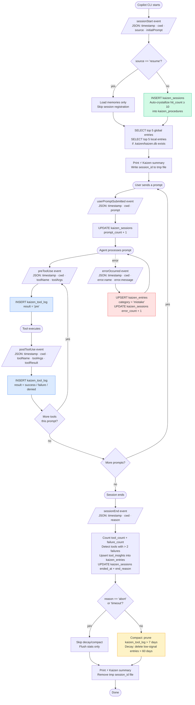

# Kaizen Hook System

> *改善* — continuous improvement

AI coding sessions are amnesiac by default. Each session starts fresh — no memory of what worked, what broke, which tools you reach for most, or what patterns your team has settled on. **Kaizen** fixes that.

Kaizen hooks into the Copilot CLI event system and builds a persistent, compounding memory across every session. Errors accumulate into patterns. Patterns crystallize into procedures. Procedures feed back into the next session — tightening the loop over time.

```
Observe → Reflect → Improve → Observe better
   ↑                                   │
   └───────────────────────────────────┘
```

---

## Quick Start

### Bash (Linux / macOS / Windows+GitBash)

```bash
# From your target repo root:
mkdir -p .github/hooks/kaizen
cp /path/to/kaizen/kaizen.sh   .github/hooks/kaizen/
cp /path/to/kaizen/kaizen.ps1  .github/hooks/kaizen/
cp /path/to/kaizen/hooks.json  .github/hooks/kaizen.json
chmod +x .github/hooks/kaizen/kaizen.sh
```

### PowerShell (Windows / pwsh everywhere)

```powershell
# From your target repo root:
New-Item -ItemType Directory -Force -Path .github/hooks/kaizen
Copy-Item kaizen.sh, kaizen.ps1  -Destination .github/hooks/kaizen/
Copy-Item hooks.json             -Destination .github/hooks/kaizen.json
```

The runtime loads any `*.json` file under `.github/hooks/` — the filename `kaizen.json` is just a convention.

---

## How It Works — The Six-Event Loop

Kaizen registers six lifecycle events. Each handler is designed to exit in **milliseconds** — all SQLite writes happen in a background process so the agent is never blocked.

| Event | What Kaizen does |
|-------|-----------------|
| `sessionStart` | Loads top observations into agent context; registers the session; auto-crystallizes high-signal entries |
| `userPromptSubmitted` | Increments `prompt_count` on the session row |
| `preToolUse` | Logs tool intent (`result = 'pre'`) — evidence of attempted calls even if the tool crashes |
| `postToolUse` | Logs tool result (`success` / `failure` / `denied`) |
| `errorOccurred` | Upserts the error as a `mistake` observation; increments session `error_count` |
| `sessionEnd` | Finalises session stats; promotes repeated tool failures to observations; runs decay/compact cleanup |

> **Why log `'pre'`?** If a tool crashes before `postToolUse` fires, the `'pre'` row is the only evidence it was attempted. At session end: `abandoned = pre_rows − (success + failure + denied)`.

---

## Two-Tier Memory

Kaizen maintains **two SQLite databases**:

| | Global `~/.copilot/kaizen.db` | Local `.kaizen/kaizen.db` |
|--|-------------------------------|---------------------------|
| **Scope** | All repos on this machine | This repo only |
| **What lives here** | Errors, patterns, tool insights, session metadata | Repo-specific conventions, team preferences |
| **Read by** | All session starts | Session starts (when file exists) |
| **Written by** | All events | Your team, manually |
| **Team sharing** | Not shared | Commit `.kaizen/kaizen.db` to share with your team |

### DB writes by event

| Event | Global DB | Local DB |
|-------|-----------|----------|
| `sessionStart` | READ entries; INSERT session; WRITE procedures | READ entries |
| `userPromptSubmitted` | UPDATE session `prompt_count` | — |
| `preToolUse` | INSERT tool log (`result='pre'`) | — |
| `postToolUse` | INSERT tool log (actual result) | — |
| `errorOccurred` | UPSERT mistake entry; UPDATE session `error_count` | — |
| `sessionEnd` | UPDATE session; INSERT tool insights; DELETE old rows | — |

---

## How Observations Compound

The `hit_count` field is the core signal. Every time the same error is seen again, `hit_count` increments. When it reaches **10**, the entry is auto-crystallized into `kaizen_procedures` at the next `sessionStart`.

| When | What happens |
|------|-------------|
| **Day 1** | A `NetworkTimeoutError` appears once. `hit_count = 1`. |
| **Week 2** | Same error seen 7 more times. `hit_count = 8`. Starts surfacing in top-5. |
| **Month 2** | `hit_count` hits 10. Auto-crystallized into `kaizen_procedures` at next session start. |
| **Month 3** | The crystallized procedure has `applied_count = 12`. Agent has been acting on it every session. |

Low-signal entries (`hit_count < 3`) older than 60 days are pruned automatically. Only signal survives.

---

## Adding Observations Manually

Insert directly into the global or local database:

```bash
# Record a codebase-specific convention
sqlite3 ~/.copilot/kaizen.db "
INSERT INTO kaizen_entries (scope, category, content, source)
VALUES ('global', 'preference', 'Always run npm run lint before committing', 'manual');
"

# Record a team convention in the local (repo-shared) DB
sqlite3 .kaizen/kaizen.db "
INSERT INTO kaizen_entries (scope, category, content, source)
VALUES ('local', 'pattern', 'Use Result<T> not exceptions for expected failures', 'team');
"
```

### Categories

| Category | Use for |
|----------|---------|
| `pattern` | Code patterns, architectural conventions, naming rules |
| `mistake` | Errors, bugs, anti-patterns to avoid |
| `preference` | Tooling preferences, workflow shortcuts |
| `tool_insight` | Observations about tool usage (auto-populated by hooks) |

---

## Phase 2 Preview — The Self-Improving Loop

Phase 1 observes and remembers. Phase 2 will make the improvement process itself better.

The `kaizen_procedures` table and `crystallized` flag are live today — no schema migrations needed when Phase 2 ships. A future `crystallize` command will:

1. Query entries with `hit_count >= 10` not yet crystallized
2. Group by `category` and distil them into structured procedures
3. Emit `.kaizen/procedures/<category>.md` — human-readable, commitable
4. Track `applied_count` per procedure — dropping procedures nobody uses

The loop: better observations → better procedures → better sessions → better observations.

---

## Disable

Set `SKIP_KAIZEN=1` to disable all hooks for a session:

```bash
SKIP_KAIZEN=1 gh copilot suggest "..."
```

Or permanently for a shell:

```bash
export SKIP_KAIZEN=1
```

---

## Requirements

| Dependency | Bash | PowerShell | Notes |
|-----------|------|-----------|-------|
| `sqlite3` | Required | Required | macOS/Linux: pre-installed. Windows: `winget install SQLite.SQLite` |
| `jq` | Optional | Not used | Falls back to `python3`/`python`, then `sed` |
| `python3`/`python` | Optional fallback | Not used | Used when `jq` is absent |
| `git` | Optional | Optional | Used only to resolve repo name from remote |

PowerShell uses `ConvertFrom-Json` natively — no external JSON tools needed.

---

## Flow Diagram



---

## File Reference

```
hooks/kaizen/
├── README.md      ← this file
├── hooks.json     ← install at .github/hooks/kaizen.json in target repo
├── kaizen.sh      ← bash implementation (Linux / macOS / Windows+GitBash)
└── kaizen.ps1     ← PowerShell implementation (Windows native / pwsh everywhere)
```

### Install paths (after copying)

```
.github/hooks/
├── kaizen.json          ← hooks manifest (copied from hooks.json)
└── kaizen/
    ├── kaizen.sh        ← must be executable (chmod +x)
    └── kaizen.ps1
```
